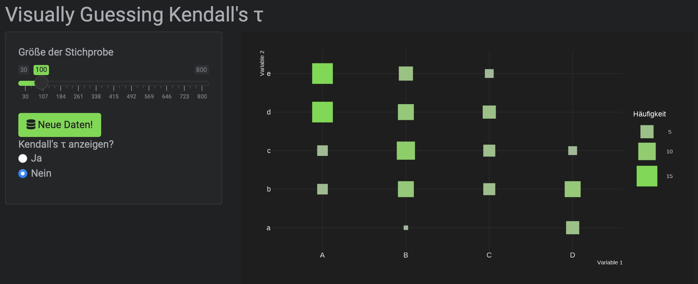
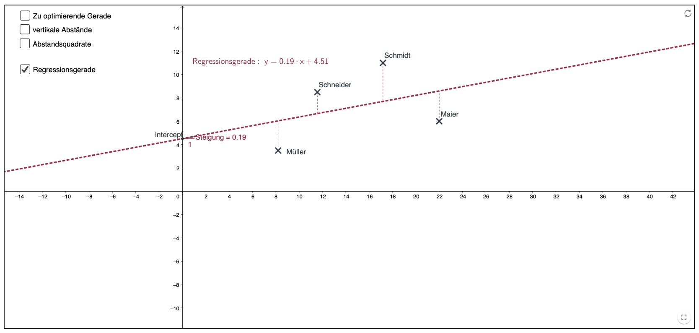
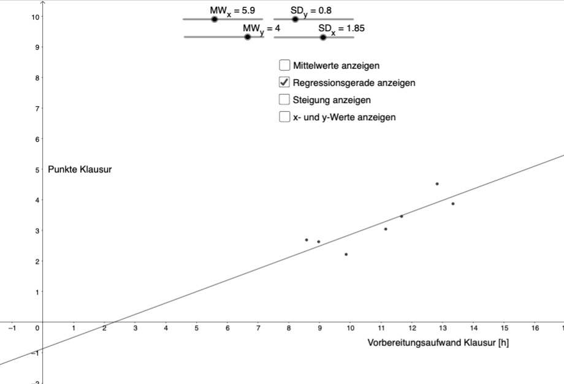
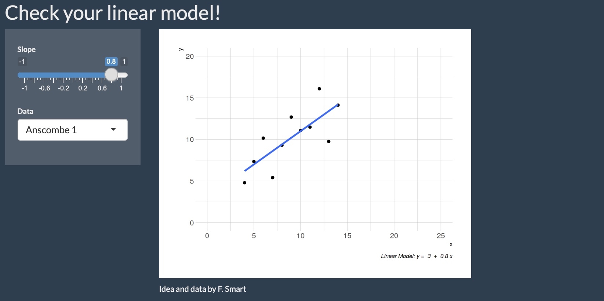
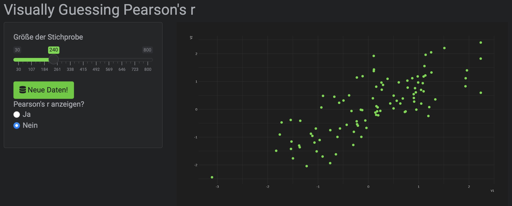

class: center,  middle, hide_logo


<head>
<script src="https://kit.fontawesome.com/994a28441d.js" crossorigin="anonymous"></script>
<script src="//cdn.wordart.com/wordart.min.js" async defer></script>
</head>

<!--<div class="my-footer"><span>Folien CC-BY verfügbar unter https://atelier-phka-merk-2020.netlify.app</span></div> 


<style>
.remark-slide-number {
  font-size: 10pt;
  margin-bottom: -11.6px;
  margin-right: 10px;
  color: red; /* white */
  opacity: 0; /* default: 0.5 */
}
</style>
--> 

```{r xaringan-themer, echo=F, warning=FALSE}
library(xaringanthemer)
library(fontawesome)
library(xaringanExtra)

extra_css <- list(
  ".cit"  = list("font-size" = "70%",
                 "color" = "#6AEE3E90"),
  ".em05" = list("font-size" ="0.5em"),
  ".em06" = list("font-size" ="0.6em"),
  ".em07" = list("font-size" ="0.7em"),
  ".em08" = list("font-size" ="0.8em"),
  ".em09" = list("font-size" ="0.9em"),
  ".em11" = list("font-size" ="1.1em"),
  ".em12" = list("font-size" ="1.2em"),
  ".em13" = list("font-size" ="1.3em"),
  ".em14" = list("font-size" ="1.4em"),
  ".em15" = list("font-size" ="1.5em"),
  ".em16" = list("font-size" ="1.6em"),
  ".em17" = list("font-size" ="1.7em"),
  ".em18" = list("font-size" ="1.8em"),
  ".em19" = list("font-size" ="1.9em"),
  ".bold" = list("font-weight" = "bold"),
  ".large" = list("font-size" = "160%"),
  ".vertmiddle" = list("vertical-align" ="middle"),
  #".lh15" = list("line-height" =  "1.5"),
  ".li" = list("line-height" =  "1.5",
               "font-size" = "160%",
               "font-weight" = "bold"),
  ".phgreen" = list("color" = "#50B32E"),
  ".phgreenlight" = list("color" = "#62DC3A"),
  ".pgl" = list("color" = "#62DC3A"),
 # ".my-footer" = list("background-color" = "#1a1917",
 #                     "position" = "absolute",
 #                     "bottom" = "0px",
 #                     "left" = "0px",
 #                     "height" = "20px",
 #                     "width" = "100%"),
  ".my-footer span" = list("font-size" = "10pt", 
                           "color" = "#F7F8FA",
                           "position" = "absolute",
                           "left" = "15px",
                           "bottom" = "2px"),
  ".remark-slide-number" = list("bottom" = "-18px"),
  ".li" = list("line-height" =  "4"),
  ".scroll-box-18" = list("height" ="18em",
                           "overflow-y" = "scroll"),
  ".scroll-box-23" = list("height" ="23em",
                           "overflow-y" = "scroll"),
  ".hscroll-box-30" = list("width" ="23em",
                           "overflow-x" = "scroll"))

style_mono_accent(
  background_color = "#000000",
  background_image = "https://live.staticflickr.com/65535/50973602108_8fce3f8f28_k.jpg",
  text_color = "#ffffff",
  base_color           = "#ffffff",
  header_font_google   = google_font("Roboto", "700"),
  text_font_google     = google_font("Roboto", "500"),
  code_font_google     = google_font("Droid Mono"),
  extra_css = extra_css,
  inverse_background_color = "#ffffff",
  inverse_text_color = "#000000",
  link_color = "#6AEE3E"
)

use_logo(
  image_url = "https://svgur.com/i/X57.svg",#"https://live.staticflickr.com/65535/50974533397_9ac99f9a48_o.png",
  width = "180px",
  position = css_position(top = "1.5em", right = "1.5em")
)

use_editable(expires = 1)
```

# .white[Vorlesung: Forschungsmethoden]


.em14[<i class="fas fa-microscope fa-5x"></i>]

### .white[Sitzung 12: Zusammenhänge ordinaler und intervallskalierter Variablen]

  &nbsp;&nbsp;&nbsp;&nbsp;


.em14[.white[&nbsp;&nbsp;&nbsp;&nbsp;&nbsp;&nbsp;André Epp | Samuel Merk]]  


---
# Überblick
.em13[
* Zusammenhänge ordinaler Variablen
   * beschreiben (Effektstärke Kendall's $\tau$) und
   * testen (Inferenzstatistiken: p-Wert und Bayes Faktor)
* Zusammenhänge metrischer Variablen
   * beschreiben (Effektstärke, Pearson's $r$) und
   * testen (Inferenzstatistiken: p-Wert und Bayes Faktor).
]
---
class: center, middle
# Zusammenhänge ordinaler Variablen beschreiben und testen

---
class: hide_logo
## Bsp. ordinale Korrelation: Stimmung und Wetter
.pull-left[
### Daten 1
```{r, echo = F, message=FALSE}
library(reactable)
library(tidyverse)
library(fontawesome)
options(reactable.theme = reactableTheme(
  color = "hsl(233, 9%, 87%)",
  backgroundColor = "#a51e4100",
  borderColor = "#ffffff",
  stripedColor = "hsl(233, 12%, 22%)",
  highlightColor = "hsl(233, 12%, 24%)",
  inputStyle = list(backgroundColor = "hsl(233, 9%, 25%)"),
  selectStyle = list(backgroundColor = "hsl(233, 9%, 25%)"),
  pageButtonHoverStyle = list(backgroundColor = "hsl(233, 9%, 25%)"),
  pageButtonActiveStyle = list(backgroundColor = "hsl(233, 9%, 28%)")
))

faf <- function(x, y) {paste0("<a>", as.character(fontawesome::fa(x, fill = y)), "</a>")}

sp_1 <- data.frame(Stimmung = c(faf("smile", "#ffffff"),
                              faf("frown", "#ffffff"),
                              faf("grin-squint-tears", "#ffffff"),
                              faf("meh", "#ffffff")),
                   Wetter = c(faf("cloud-sun", "#ffffff"),
                                faf("cloud-showers-heavy", "#ffffff"),
                                faf("sun", "#ffffff"),
                                faf("cloud", "#ffffff")))
reactable(sp_1,
          defaultColDef = colDef(html = TRUE,
                                 align = "center",
                                 width = 130))
```

]

--

.pull-right[
### Daten 2
```{r, echo = F, message=FALSE}
sp_2 <- data.frame(Stimmung = c(faf("grin-squint-tears", "#ffffff"),
                                faf("smile", "#ffffff"),
                              faf("frown", "#ffffff"),
                              faf("meh", "#ffffff")),
                   Wetter = c(faf("cloud-sun", "#ffffff"),
                                faf("cloud-showers-heavy", "#ffffff"),
                                faf("sun", "#ffffff"),
                                faf("cloud", "#ffffff")))
reactable(sp_2,
          defaultColDef = colDef(html = TRUE,
                                 align = "center",
                                 width = 130))
```

]

---
class: hide_logo
## Bsp. ordinale Korrelation: Kendall's $\tau$
.pull-left[
### Daten 1
```{r, echo = F, message=FALSE}
reactable(sp_1,
          defaultColDef = colDef(html = TRUE,
                                 align = "center",
                                 width = 130))
```

]


.pull-right[

$$\tau_A=\frac{\text{#(konk. Paare)}-\text{#(disk. Paare)}}{\text{#Paare}}$$
]


---
class: hide_logo
## Bsp. ordinale Korrelation: Kendall's $\tau$
.pull-left[
### Daten 2
```{r, echo = F, message=FALSE}
reactable(sp_2,
          defaultColDef = colDef(html = TRUE,
                                 align = "center",
                                 width = 130))
```

]


.pull-right[

$$\tau_A=\frac{\text{#(konk. Paare)}-\text{#(disk. Paare)}}{\text{#Paare}}$$
]

---
class: hide_logo
## Problem »Rangbindungen«
.pull-left[
### Daten 3
```{r, echo = F, message=FALSE}
sp_3 <- data.frame(Stimmung = c(faf("smile", "#ffffff"),
                              faf("frown", "#ffffff")),
                   Wetter = c(faf("cloud-sun", "#ffffff"),
                                faf("cloud-showers-heavy", "#ffffff")))
reactable(sp_3,
          defaultColDef = colDef(html = TRUE,
                                 align = "center",
                                 width = 130))
```

]


.pull-right[
### Daten 4
```{r, echo = F, message=FALSE}
sp_4 <- data.frame(Stimmung = c(faf("smile", "#ffffff"),
                                faf("smile", "#ffffff"),
                              faf("frown", "#ffffff"),
                              faf("frown", "#ffffff")),
                   Wetter = c(faf("cloud-sun", "#ffffff"),
                              faf("cloud-sun", "#ffffff"),
                              faf("cloud-showers-heavy", "#ffffff"),
                              faf("cloud-showers-heavy", "#ffffff")))
reactable(sp_4,
          defaultColDef = colDef(html = TRUE,
                                 align = "center",
                                 width = 130))
```
]

--
.em08[
&nbsp;<br>
$$\tau_B=\frac{\text{#(konk. Paare)}-\text{#(disk. Paare)}}{\sqrt{\left(\text{#Paare} - \color{#62DC3A}{n_1}\right)\cdot\left(\text{#Paare} - \color{#FF851B}{n_2}\right)}}\text{ mit }\color{#62DC3A}{n_1 = \sum_i{\frac{t_i \cdot (t_i - 1 )}{2}}}\text{ und } \color{#FF851B}{n_2 = \sum_i{\frac{u_i \cdot (u_i - 1 )}{2}}}\text{ wobei }$$
$$t_i = \text{Anzahl der Rangbindungen in der i-ten Kategorie der Variable 1}$$
$$u_i = \text{Anzahl der Rangbindungen in } \\ 
\text{der i-ten Kategorie der Variable 2}$$
]

---
class: hide_logo
## Kendall's $\tau_B$  
* Kendall's $\tau_B$ definiert als  
$$\tau_B=\frac{\text{#(konk. Paare)}-\text{#(disk. Paare)}}{\sqrt{\left(\text{#Paare} - \color{#62DC3A}{n_1}\right)\cdot\left(\text{#Paare} - \color{#FF851B}{n_2}\right)}}\text{ mit }\color{#62DC3A}{n_1 = \sum_i{\frac{t_i \cdot (t_i - 1 )}{2}}}\text{ und } \color{#FF851B}{n_2 = \sum_i{\frac{u_i \cdot (u_i - 1 )}{2}}}\text{ wobei }$$
$$t_i = \text{Anzahl der Rangbindungen in der i-ten Kategorie der Variable 1}$$
$$u_i = \text{Anzahl der Rangbindungen in } \\ 
\text{der i-ten Kategorie der Variable 2}$$
* .pgl[τ kann Werte zwischen -1 und 1] annehmen. 0 steht dabei für die Abwesenheit einer Assoziation der beiden Variablen; -1 bzw. 1 für eine maximale negative bzw. positive Assoziation.  
<br>
* .pgl[p-Werte und Bayes Faktoren] testen typischerweise die Nullhypothese $H_0: \tau = 0$
* Nach Cohen (1988), gilt $\tau =.1$ als kleiner Effekt und $\tau =.3$ bzw. $\tau =.5$ als mittlerer bzw. starker Effekt.

---
class: center middle
# Berechnung Kendall's $\tau$ mit jamovi
```{r echo = F, results='hide'}
library(haven)
library(synthpop)
allbus2018 <- read_spss("../allbus2018.sav")
data_allbus_educ_pairs <- 
  allbus2018 %>% 
  dplyr::select(ends_with("educ")) %>% 
  filter(!(educ %in% c(6,7) | sceduc %in% c(6,7) |
             peduc %in% c(6,7) |feduc %in% c(6,7) |meduc %in% c(6,7)))


write_csv(data_allbus_educ_pairs, "Bildungsabschluesse_ALLBUS2018.csv")
```


---
# Guessing Kendall's $\tau$


[](https://apps.samuel-merk.de/guessing_kendalls-tau)

<i class="fas fa-external-link-alt" style="color:#62DC3A"></i> &nbsp; https://apps.samuel-merk.de/guessing-kendalls-tau


---
class: center middle
# Korrelation zweier intervallskalierter Variablen

---
class: hide_logo
## Regressionsgerade als Zusammenhangsmodell

[](https://www.geogebra.org/m/wDpDdS7g)

<i class="fas fa-external-link-alt" style="color:#62DC3A"></i> &nbsp; https://www.geogebra.org/m/wDpDdS7g

---
class: hide_logo
## Korrelation als standardisierte Regression

[](https://www.geogebra.org/m/mR3kx7Fm)

<i class="fas fa-external-link-alt" style="color:#62DC3A"></i> &nbsp; https://www.geogebra.org/m/mR3kx7Fm

---
class: hide_logo
## Die Produkt-Moment-Korrelation (Definition) 
### a.k.a. Pearson's Correlation $r$ a.k.a. »die Korrelation»
* Die Produkt-Moment-Korrelation ist formal definiert als  
$$r(X,Y) = \frac{\sum_{i=1}^n(x_i - \bar{x})\cdot(y_i - \bar{y})}{\sqrt{\sum_{i=1}^n(x_i - \bar{x})^2} \cdot \sqrt{\sum_{i=1}^n(y_i - \bar{y})^2}}$$

* .pgl[ r kann Werte zwischen -1 und 1] annehmen. 0 steht dabei für die Abwesenheit einer Assoziation der beiden Variablen; -1 bzw. 1 für eine maximale negative bzw. positive Assoziation.  
* .pgl[p-Werte und Bayes Faktoren] testen typischerweise die Nullhypothese $H_0: \text{r = 0}$
* Nach Cohen (1988), gilt $r =.1$ als kleiner Effekt und $r =.3$ bzw. $r =.5$ als mittlerer bzw. starker Effekt.
---
class: hide_logo
## Häufige Fehlinterpretationen
* $r(X,Y) \ne 0 \text{ und }p<.05 \Rightarrow$ kausaler Zusammenhang zwischen X und Y  
&nbsp;<br>
.center[
```{r, echo = F, out.width="25%", fig.cap="https://xkcd.com/552/"}
knitr::include_graphics("https://imgs.xkcd.com/comics/correlation.png")
```
]&nbsp;<br>
* $r(X,Y) = 0 \Rightarrow$ keinerlei Assoziation zwischen X und Y   
&nbsp;<br>.
.center[
```{r, echo = F, out.width="25%", fig.cap="https://samuel-merk.de/check-your-linear-model"}

```
]

---
class: hide_logo
## Annahme für die Berechnung der p-Werte und Bayes Faktoren
* V1, V2 müssen bivariat normalverteilt sein

```{r, fig.width=12, fig.height=5, echo = F, warning=FALSE}
library(tidyverse)
library(gridExtra)
set.seed(7274)

sigma <- matrix(c(4,2,2,3), ncol=2)
data_mvnorm <- 
  mvtnorm::rmvnorm(n=500, mean=c(1,2), sigma=sigma) %>% 
  as_tibble()
p0 <- ggplot(data_mvnorm, aes(V1, V2)) + 
  geom_point() + 
  theme_classic() +
  ggtitle("Univariate Normalverteilungen (V1, V2)",
          "und Bivariate Normalverteilung")
p1 <- ggExtra::ggMarginal(p0, type = "histogram")


V1 <- rnorm(1000)
V2 <- rnorm(1000)
V3 <- rnorm(1000)
V4 <- abs(V3)*sign(V1*V2)
data_univnorm <- 
  tibble(V5 = V1[V4>0],
         V6 = V2[V4>0],)
p3 <- ggplot(data_univnorm, aes(V5, V6)) +
  geom_point() + 
  theme_classic() +
  ggtitle("Univariate Normalverteilungen (V1, V2)",
          "aber keine Bivariate Normalverteilung")
p4 <- ggExtra::ggMarginal(p3, type = "histogram")

grid.arrange(p1, p4, nrow = 1)

```

---
# Guessing Pearson's $r$


[](https://apps.samuel-merk.de/guessing-r)

<i class="fas fa-external-link-alt" style="color:#62DC3A"></i> &nbsp; https://apps.samuel-merk.de/guessing-r


---
## Literatur
Diekmann, A., Hadjar, A., Kurz, K., Rosar, U., Wagner, U., & Westle, B. (2019). _German general social survey—ALLBUS 2018._ GESIS Datenarchiv, Köln. https://doi.org/doi:10.4232/1.13325  
Kendall, M.G. (1976). _Rank Correlation Methods._ London: Griffin.  
Pearson, K., & Lee, A. (1903). On the laws of inheritance in man: I. Inheritance of physical characters. _Biometrika, 2_(4), 357–462.


