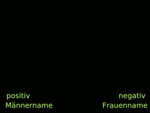

class: center,  middle, hide_logo


<head>
<script src="https://kit.fontawesome.com/994a28441d.js" crossorigin="anonymous"></script>
</head>

<!--<div class="my-footer"><span>Folien CC-BY verfügbar unter https://atelier-phka-merk-2020.netlify.app</span></div> 


<style>
.remark-slide-number {
  font-size: 10pt;
  margin-bottom: -11.6px;
  margin-right: 10px;
  color: red; /* white */
  opacity: 0; /* default: 0.5 */
}
</style>
--> 

```{r xaringan-themer, echo=F, warning=FALSE}
library(xaringanthemer)
library(fontawesome)
library(xaringanExtra)

extra_css <- list(
  ".cit"  = list("font-size" = "70%",
                 "color" = "#6AEE3E90"),
  ".em05" = list("font-size" ="0.5em"),
  ".em06" = list("font-size" ="0.6em"),
  ".em07" = list("font-size" ="0.7em"),
  ".em08" = list("font-size" ="0.8em"),
  ".em09" = list("font-size" ="0.9em"),
  ".em11" = list("font-size" ="1.1em"),
  ".em12" = list("font-size" ="1.2em"),
  ".em13" = list("font-size" ="1.3em"),
  ".em14" = list("font-size" ="1.4em"),
  ".em15" = list("font-size" ="1.5em"),
  ".em16" = list("font-size" ="1.6em"),
  ".em17" = list("font-size" ="1.7em"),
  ".em18" = list("font-size" ="1.8em"),
  ".em19" = list("font-size" ="1.9em"),
  ".bold" = list("font-weight" = "bold"),
  ".large" = list("font-size" = "160%"),
  ".vertmiddle" = list("vertical-align" ="middle"),
  #".lh15" = list("line-height" =  "1.5"),
  ".li" = list("line-height" =  "1.5",
               "font-size" = "160%",
               "font-weight" = "bold"),
  ".phgreen" = list("color" = "#50B32E"),
  ".phgreenlight" = list("color" = "#62DC3A"),
  ".pgl" = list("color" = "#62DC3A"),
 # ".my-footer" = list("background-color" = "#1a1917",
 #                     "position" = "absolute",
 #                     "bottom" = "0px",
 #                     "left" = "0px",
 #                     "height" = "20px",
 #                     "width" = "100%"),
  ".my-footer span" = list("font-size" = "10pt", 
                           "color" = "#F7F8FA",
                           "position" = "absolute",
                           "left" = "15px",
                           "bottom" = "2px"),
  ".remark-slide-number" = list("bottom" = "-18px"),
  ".li" = list("line-height" =  "4"),
  ".scroll-box-18" = list("height" ="18em",
                           "overflow-y" = "scroll"),
  ".scroll-box-23" = list("height" ="23em",
                           "overflow-y" = "scroll"),
  ".hscroll-box-30" = list("width" ="23em",
                           "overflow-x" = "scroll"))

style_mono_accent(
  background_color = "#000000",
  background_image = "https://live.staticflickr.com/65535/50973602108_8fce3f8f28_k.jpg",
  text_color = "#ffffff",
  base_color           = "#ffffff",
  header_font_google   = google_font("Roboto", "700"),
  text_font_google     = google_font("Roboto", "500"),
  code_font_google     = google_font("Droid Mono"),
  extra_css = extra_css,
  inverse_background_color = "#ffffff",
  inverse_text_color = "#000000",
  link_color = "#6AEE3E"
)

use_logo(
  image_url = "https://svgur.com/i/X57.svg",#"https://live.staticflickr.com/65535/50974533397_9ac99f9a48_o.png",
  width = "180px",
  position = css_position(top = "1.5em", right = "1.5em")
)

use_editable(expires = 1)
```

# .white[Vorlesung: Forschungsmethoden]


.em14[<i class="fas fa-microscope fa-5x"></i>]

### .white[Live-Sitzung 9: Übungen zur Datenerhebung]

  &nbsp;&nbsp;&nbsp;&nbsp;


.em14[.white[&nbsp;&nbsp;&nbsp;&nbsp;&nbsp;&nbsp;André Epp | Samuel Merk]]  


---
# Advanced Organizer
.large[
* WarmUp-Aufgabe: IAT <i class="fas fa-mobile-alt"></i>
* Ihre Fragen <i class="far fa-question-circle"></i> - gemeinsame Antworten <i class="far fa-comments"></i>.
]
---
class: hide_logo
## WarmUp-Aufgabe: Impliziter Assoziationstest (IAT)

Machen Sie sich unter http://bit.ly/merk004 (Lexikonartikel) oder http://bit.ly/merk005 (Wikipediaartikel) mit dem impliziten Assoziationstest vertraut. Beantworten Sie danach Fragen dazu unter http://bit.ly/merk006

```{r, echo = F, fig.align='center', fig.cap="Illustration auf Wikipedia.<br>Die grünen Wörter stehen für die Belegung der Reaktionstasten.", out.width="30%"}



```

--
> Methode: 🧠 - ♊️ - 👨‍🏫  

--

```{r, echo = F}
library(countdown)
countdown(minutes = 5, seconds = 00, color_running_text = "#62DC3A")
```


---
# Ihre Fragen <i class="far fa-question-circle"></i>
Stellen Sie Ihre Fragen zu Video/Aufgaben unter http://bit.ly/merk007 und voten Sie die Fragen Ihrer Kommiliton*innen.


---
# Literatur
Röhner, J., & Schütz, A. (2020). Impliziter Assoziationstest (IAT). In M. Wirtz (Hrsg.), Dorsch—Lexikon der Psychologie (S. 813). Hogrefe.
