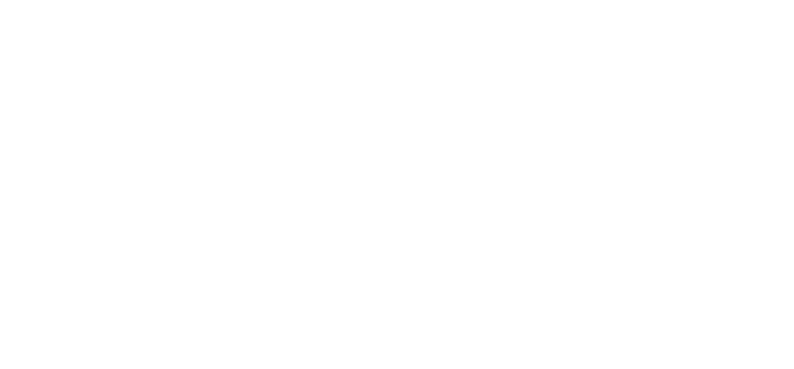
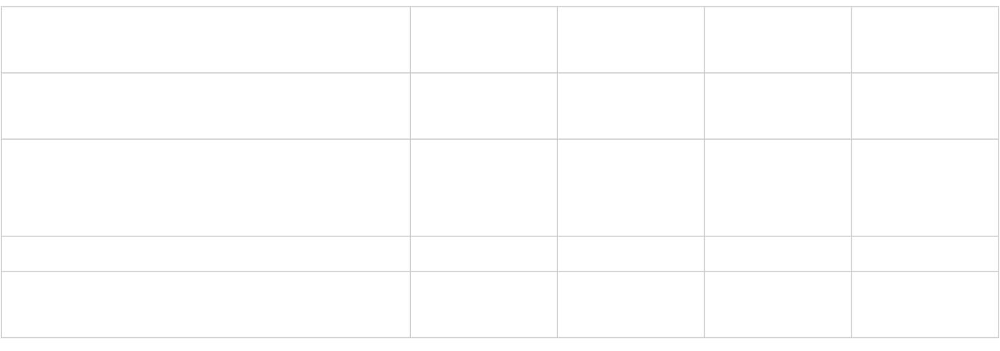

class: center,  middle, hide_logo


<head>
<script src="https://kit.fontawesome.com/994a28441d.js" crossorigin="anonymous"></script>
</head>

<!--<div class="my-footer"><span>Folien CC-BY verfügbar unter https://atelier-phka-merk-2020.netlify.app</span></div> 


<style>
.remark-slide-number {
  font-size: 10pt;
  margin-bottom: -11.6px;
  margin-right: 10px;
  color: red; /* white */
  opacity: 0; /* default: 0.5 */
}
</style>
--> 

```{r xaringan-themer, echo=F, warning=FALSE}
library(xaringanthemer)
library(fontawesome)
library(xaringanExtra)

extra_css <- list(
  ".cit"  = list("font-size" = "70%",
                 "color" = "#6AEE3E90"),
  ".em05" = list("font-size" ="0.5em"),
  ".em06" = list("font-size" ="0.6em"),
  ".em07" = list("font-size" ="0.7em"),
  ".em08" = list("font-size" ="0.8em"),
  ".em09" = list("font-size" ="0.9em"),
  ".em11" = list("font-size" ="1.1em"),
  ".em12" = list("font-size" ="1.2em"),
  ".em13" = list("font-size" ="1.3em"),
  ".em14" = list("font-size" ="1.4em"),
  ".em15" = list("font-size" ="1.5em"),
  ".em16" = list("font-size" ="1.6em"),
  ".em17" = list("font-size" ="1.7em"),
  ".em18" = list("font-size" ="1.8em"),
  ".em19" = list("font-size" ="1.9em"),
  ".bold" = list("font-weight" = "bold"),
  ".large" = list("font-size" = "160%"),
  ".vertmiddle" = list("vertical-align" ="middle"),
  #".lh15" = list("line-height" =  "1.5"),
  ".li" = list("line-height" =  "1.5",
               "font-size" = "160%",
               "font-weight" = "bold"),
  ".phgreen" = list("color" = "#50B32E"),
  ".phgreenlight" = list("color" = "#62DC3A"),
  ".pgl" = list("color" = "#62DC3A"),
 # ".my-footer" = list("background-color" = "#1a1917",
 #                     "position" = "absolute",
 #                     "bottom" = "0px",
 #                     "left" = "0px",
 #                     "height" = "20px",
 #                     "width" = "100%"),
  ".my-footer span" = list("font-size" = "10pt", 
                           "color" = "#F7F8FA",
                           "position" = "absolute",
                           "left" = "15px",
                           "bottom" = "2px"),
  ".remark-slide-number" = list("bottom" = "-18px"),
  ".li" = list("line-height" =  "4"),
  ".scroll-box-18" = list("height" ="18em",
                           "overflow-y" = "scroll"),
  ".scroll-box-23" = list("height" ="23em",
                           "overflow-y" = "scroll"),
  ".hscroll-box-30" = list("width" ="23em",
                           "overflow-x" = "scroll"))

style_mono_accent(
  background_color = "#000000",
  background_image = "https://live.staticflickr.com/65535/50973602108_8fce3f8f28_k.jpg",
  text_color = "#ffffff",
  base_color           = "#ffffff",
  header_font_google   = google_font("Roboto", "700"),
  text_font_google     = google_font("Roboto", "500"),
  code_font_google     = google_font("Droid Mono"),
  extra_css = extra_css,
  inverse_background_color = "#ffffff",
  inverse_text_color = "#000000",
  link_color = "#6AEE3E"
)

use_logo(
  image_url = "https://svgur.com/i/X57.svg",#"https://live.staticflickr.com/65535/50974533397_9ac99f9a48_o.png",
  width = "180px",
  position = css_position(top = "1.5em", right = "1.5em")
)

use_editable(expires = 1)
```

# .white[Vorlesung: Forschungsmethoden]


.em14[<i class="fas fa-microscope fa-5x"></i>]

### .white[Sitzung 9: Theorie und Praxis der Datenerhebung]

  &nbsp;&nbsp;&nbsp;&nbsp;


.em14[.white[&nbsp;&nbsp;&nbsp;&nbsp;&nbsp;&nbsp;André Epp | Samuel Merk]]  


---
# Advanced Organizer
.em13[
* Was ist eine Messung?
* Typologien von Variablen
     * Inferenzniveau
     * Theoretischer Kausalzusammenhang
     * Skalenniveaus
* Gütekriterien einer Messung 
* Erhebungsverfahren
    * Beobachtung
    *	Interview
    * Fragebogen
    * (Psychologischer) Test
    * Physiologische Messungen
    * Dokumentenanalyse
* Vertiefung: Fragebogendesign


]


---
class: inverse, center, middle

# Was ist eine Messung? <br> (Theorie der Datenerhebung)

---

## Warum Theorie zur Datenqualität?
> Datenqualität (DQ) stellt eine __notwendige Bedingung__ der internen und externen Validität dar.

&nbsp;  

--

$$\neg \text{ hohe Datenqualität} \Rightarrow \neg  \text{ interne/externe Validität}\\
\text{bzw.}\\
\text{interne/externe Validität} \Rightarrow \text{hohe Datenqualität}$$


---
# Daten erheben = Variablen messen
>  Eine Messung („measurement“) meint in der quantitativen Sozialforschung eine Zuordnung von Zahlen zu Objekten oder Ereignissen, sofern diese Zuordnung eine homomorphe (strukturerhaltende) Abbildung eines empirischen Relativs in ein numerisches Relativ ist .cit[(Orth, 1983; S. 138)].


---
# Daten erheben = Variablen messen
>  Eine Messung („measurement“) meint in der quantitativen Sozialforschung eine Zuordnung von Zahlen zu Objekten oder Ereignissen, sofern diese Zuordnung eine homomorphe (strukturerhaltende) Abbildung eines empirischen Relativs in ein numerisches Relativ ist .cit[(Orth, 1983; S. 138)].

---
class: inverse, center, middle

# Typologie Variablen

---
## Typologie I: Skalenniveaus
&nbsp;  
> Das Skalenniveau einer Variable beschreibt, welche Relationen im numerischen Relativ sinnvoll sind .cit[(Döring & Bortz, 2016)].  

&nbsp;  
```{r, echo = F, message=FALSE}
library(tidyverse)
library(reactable)
options(reactable.theme = reactableTheme(
  color = "hsl(233, 9%, 87%)",
  backgroundColor = "#a51e4100",
  borderColor = "#ffffff",
  stripedColor = "hsl(233, 12%, 22%)",
  highlightColor = "hsl(233, 12%, 24%)",
  inputStyle = list(backgroundColor = "hsl(233, 9%, 25%)"),
  selectStyle = list(backgroundColor = "hsl(233, 9%, 25%)"),
  pageButtonHoverStyle = list(backgroundColor = "hsl(233, 9%, 25%)"),
  pageButtonActiveStyle = list(backgroundColor = "hsl(233, 9%, 28%)")
))

reactable(
  tibble(Skalenniveau = c("Nominalskala", "Ordinalskala", "Intervallskala"),
         `Sinnvolle Relationen` = c("Gleichheit", "Gleichheit + Ordnung", 
                                    "Gleichheit + Ordnung + Abstand"),
         `Beispiel` = c("Lieblingsfach", "Grundschulempfehlung", 
                        "tägl. Internetnutzung")),
  defaultColDef = colDef(align = "center"),
  resizable = TRUE,
  wrap = FALSE,
  showPageSizeOptions = TRUE,
  highlight = TRUE,
  borderless = TRUE, 
  width = "900px"
)
```

---
## Typologie I: Skalenniveaus
&nbsp;  
> Das Skalenniveau einer Variable beschreibt, welche Relationen im numerischen Relativ sinnvoll sind .cit[(Döring & Bortz, 2016)].  

&nbsp;  
```{r, echo = F}
reactable(
   tibble(`Schüler*in` = c("Kai", "Aise", "Petra"),
         `Lieblingsfach` = c(1,2,1),
         `tägl. Internetnutzung` = c(20, 90, 110)),
  defaultColDef = colDef(align = "center"),
  resizable = TRUE,
  wrap = FALSE,
  showPageSizeOptions = TRUE,
  highlight = TRUE,
  borderless = TRUE,
  width = "800px"
)

```


---
## Typologie Variablen II: Inferenzniveau
> Das Inferenzniveau einer Variable beschreibt in welchem Ausmaß bei einer Messung geschlussfolgert/abstrahiert wird.

--
.pull-left[
### Niedriginferente Variablen
* Sind mehr oder weniger direkt beobachtbar
* Werden durch "Kodierungen" generiert
* Beispiel: _"Anzahl der Fehltage einer Schülerin"_]
--
.pull-right[
### Hochinferente Variablen
* Sind nicht direkt beobachtbar
* Werden durch "Ratings" generiert
* Beispiel: _"Kognitive Aktivierung"_
]


---
## Typologie  III: __Theo. Kausalzusammenhang__
### Beispiel: 
.em09[
```{r, echo = F}
data_1 <- 
  tibble(`Schüler*in` =              c(1,2,3,4,5,"..."),
         `Spielt Counterstrike (SC)` =     c(0,1,1,0,0,"..."),
         `Schlägt Mitschüler*innen (SM)` = c(0,1,1,0,0,"..."),
         `Hat aggres. Gedanken (AG)` =     c(0,1,1,1,0,"..." ),
         `Alter (AL)` =                    c(12,19,6,15,6, "..."))

reactable(
  data_1,
  defaultColDef = colDef(align = "center"),
  columns = list(
  `Alter (AL)` = colDef(maxWidth = 130),
  `Schüler*in` = colDef(maxWidth = 130)),
  resizable = TRUE,
  wrap = FALSE,
  showPageSizeOptions = TRUE,
  striped = FALSE,
  highlight = TRUE,
  borderless = TRUE
)
```
]


---
## Unabhängigkeit (Orthog.) der Typologien 
&nbsp;  
&nbsp;  
&nbsp;  
```{r, echo = F, out.width="70%",fig.align='center'}

```


---
class: inverse, center, middle

# Gütekriterien einer Messung

---
## Objektivität 

.em09[
####  Durchführungsobjektivität
> _"Unabhängigkeit des Testergebnisses von der Person, die den Test mit der Testperson durchführt"_  

####  Auswertungsobjektivität
> _"Unabhängigkeit des Testergebnisses von der Person, die den Test auswertet"_

####  Interpretationsobjektivität
> _"Unabhängigkeit des Testergebnisses von der Person, die den Testwert interpretiert"_ .cit[(Döring & Bortz, 2016)]
]


---
# Reliabilität
> Reliabilität ist Ausmaß an Messfehlerfreiheit

--

#### Beispiel: Erfassung mithilfe einer Skala
```{r, echo = F, out.width="70%", fig.align='center'}

```


---
## Validität
####  Kriteriumsvalidität
> _"Ein Test weist Kriteriumsvalidität auf, wenn vom Verhalten der Testperson innerhalb der Testsituation erfolgreich auf ein »Kriterium«, nämlich auf ein Verhalten außerhalb der Testsituation, geschlossen werden kann."_ .cit[(Moosbrugger & Kelava, 2012)]  

####  Konstruktvalidität
> Das Ausmaß der theoretischen und empirischen Belege für die Angemessenheit der Interpretation von Testwerten. .cit[(Cronbach & Meehl, 1955)]


---
class: inverse, center, middle

# Ausgewählte Erhebungsverfahren <br>(Praxis der Datenerhebung)

---
# Beobachtung

> Wissenschaftliche Beobachtung ist die systematische und regelgeleitete Registrierung des Auftretens bzw. der Ausprägung von ausgewählten, psychologisch relevanten Merkmalen oder Ereignissen. Sie folgt einem zuvor festgelegten Beobachtungsplan, der festlegt,
1. was beobachtet werden soll (Kategorien für das/die interessierende/n Ereignis/ se oder Merkmal/e);
2. welche Aspekte weniger oder nicht relevant sind;
3. welchen Interpretationsspielraum der Beobachtende bei der Beobachtung hat;
4. wann, wie lange und wo die Beobachtung erfolgt (Zeitpunkte, Zeiträume, Situationen);
5. auf welche Weise das Beobachtete registriert und protokolliert wird. .cit[(Hussy et al., 2013)] 

--

.pull-left[### Zentrale Vorteile
* Potentielle Vermeidung von .pgl[Reaktanz]
* Teilw. höhere Reliabilität]

.pull-right[### Zentrale Nachteile
* Oft nicht ökonomisch
* Kognitive und psychische Variablen oft nur schwierig zugänglich]

---
class: hide_logo
## Selbstauskunft: Interview, Fragebögen, Tests

--

.pull-left[### Zentrale Vorteile
* Kognitive und psychische Variablen u.U. zugänglich
* u.U. sehr ökonomisch]

.pull-right[### Zentrale Nachteile
* Reaktanz oft höher
* Entwicklung von Fragebögen oft sehr aufwändig]


---
# Physiologische Messungen

---
# Dokumentenanalyse

---
# Vertiefung: Fragebogendesign

---
# Fragebogendesign: Begriffe
* Item := Einzelfrage
* Skala := Mehrerer Items die Operationalisierungen einer Varablen darstellen
* Rating-Item := Item das intervallskaliert ist
* Likert-Item := Items deren Stamm eine Aussage darstellt und deren Antwortmöglichkeit die abgestufte Zustimmungen zu dieser Aussage enthalten
* Offenes Item := Item bei dem die Antwortmöglichkeitn nicht vorgegeben sind
* Mittelkategorie := Antwortmöglichkeit die äquidistant zu den beiden Polen ist
* Unipolares Item := Item das geringe bis starke Ausprägungen eines einzigen Merkmals umfasst (z.B. »gar nicht« bis »sehr«)
* Bipolares Item := Item das von einem Pol über eine neutrale Kategorie bis zu einem anderen Pol formuliert ist (z.B. »lehne ab« über »weder noch« bis »stimme zu«). 

---
# Fragebogendesign: Faustregeln
* Verwenden Sie unbedingt nach Möglichkeit etablierte (also von Wissenschaftler\*innen validierte) Items und Skalen. Dies wird umso wichtiger je höherinferent ihre Variable ist.
* Formulieren Sie Items so, dass sie das möglichst hohe Skalenniveau erhalten (statt »Rauchen Sie?«, »Wie viele Zigaretten rauchen Sie durchschnittlich pro Tag?«)
* Vermeiden Sie mehrdimensionale Interpretationsmöglichkeiten (typisch bei und/oder Verknüpfungen z.B. »Ich fahre sehr gerne und sehr schnell Auto«)
* Vermeiden Sie (doppelte) Verneinungen (z.B. »Ich bin nicht oft unglücklich«)
* Implementieren Sie Qualitätschecks (z.B. sog. Items mit sicherer Antwort im gleichen Antwortformat wie die vorherigen Items »Ich bin noch nie im Leben zu spät gekommen«)
* Planen Sie für jedes Item eine Auswertungsstrategie bevor Sie die Daten erheben. 


