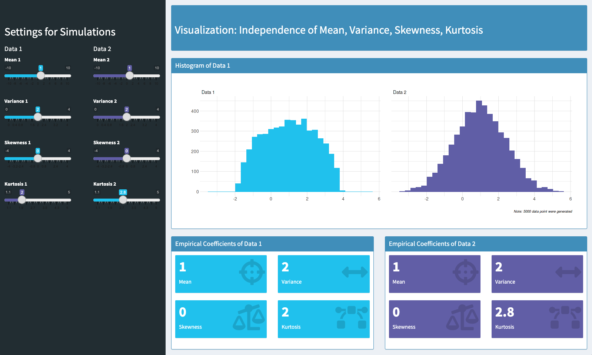
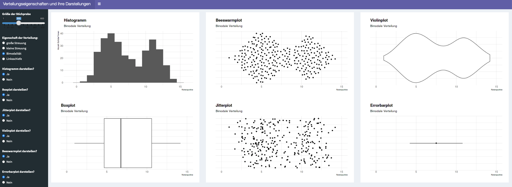
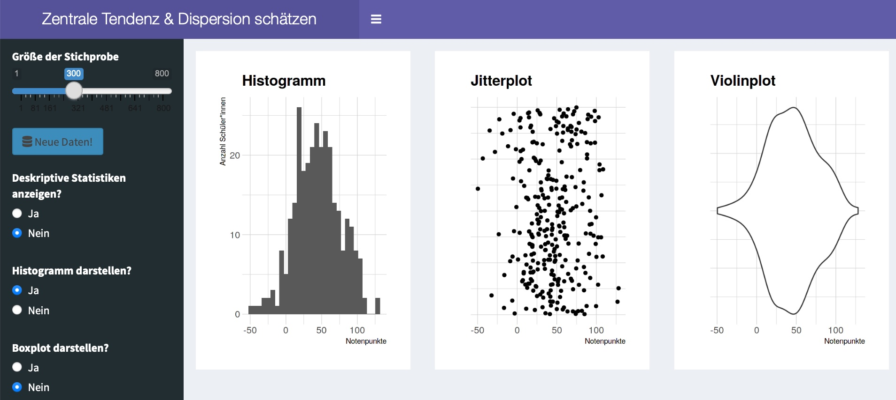

class: center,  middle, hide_logo


<head>
<script src="https://kit.fontawesome.com/994a28441d.js" crossorigin="anonymous"></script>
<script src="//cdn.wordart.com/wordart.min.js" async defer></script>
</head>

<!--<div class="my-footer"><span>Folien CC-BY verfügbar unter https://atelier-phka-merk-2020.netlify.app</span></div> 


<style>
.remark-slide-number {
  font-size: 10pt;
  margin-bottom: -11.6px;
  margin-right: 10px;
  color: red; /* white */
  opacity: 0; /* default: 0.5 */
}
</style>
--> 

```{r xaringan-themer, echo=F, warning=FALSE}
library(xaringanthemer)
library(fontawesome)
library(xaringanExtra)

extra_css <- list(
  ".cit"  = list("font-size" = "70%",
                 "color" = "#6AEE3E90"),
  ".em05" = list("font-size" ="0.5em"),
  ".em06" = list("font-size" ="0.6em"),
  ".em07" = list("font-size" ="0.7em"),
  ".em08" = list("font-size" ="0.8em"),
  ".em09" = list("font-size" ="0.9em"),
  ".em11" = list("font-size" ="1.1em"),
  ".em12" = list("font-size" ="1.2em"),
  ".em13" = list("font-size" ="1.3em"),
  ".em14" = list("font-size" ="1.4em"),
  ".em15" = list("font-size" ="1.5em"),
  ".em16" = list("font-size" ="1.6em"),
  ".em17" = list("font-size" ="1.7em"),
  ".em18" = list("font-size" ="1.8em"),
  ".em19" = list("font-size" ="1.9em"),
  ".bold" = list("font-weight" = "bold"),
  ".large" = list("font-size" = "160%"),
  ".vertmiddle" = list("vertical-align" ="middle"),
  #".lh15" = list("line-height" =  "1.5"),
  ".li" = list("line-height" =  "1.5",
               "font-size" = "160%",
               "font-weight" = "bold"),
  ".phgreen" = list("color" = "#50B32E"),
  ".phgreenlight" = list("color" = "#62DC3A"),
  ".pgl" = list("color" = "#62DC3A"),
 # ".my-footer" = list("background-color" = "#1a1917",
 #                     "position" = "absolute",
 #                     "bottom" = "0px",
 #                     "left" = "0px",
 #                     "height" = "20px",
 #                     "width" = "100%"),
  ".my-footer span" = list("font-size" = "10pt", 
                           "color" = "#F7F8FA",
                           "position" = "absolute",
                           "left" = "15px",
                           "bottom" = "2px"),
  ".remark-slide-number" = list("bottom" = "-18px"),
  ".li" = list("line-height" =  "4"),
  ".scroll-box-18" = list("height" ="18em",
                           "overflow-y" = "scroll"),
  ".scroll-box-23" = list("height" ="23em",
                           "overflow-y" = "scroll"),
  ".hscroll-box-30" = list("width" ="23em",
                           "overflow-x" = "scroll"))

style_mono_accent(
  background_color = "#000000",
  background_image = "https://live.staticflickr.com/65535/50973602108_8fce3f8f28_k.jpg",
  text_color = "#ffffff",
  base_color           = "#ffffff",
  header_font_google   = google_font("Roboto", "700"),
  text_font_google     = google_font("Roboto", "500"),
  code_font_google     = google_font("Droid Mono"),
  extra_css = extra_css,
  inverse_background_color = "#ffffff",
  inverse_text_color = "#000000",
  link_color = "#6AEE3E"
)

use_logo(
  image_url = "https://svgur.com/i/X57.svg",#"https://live.staticflickr.com/65535/50974533397_9ac99f9a48_o.png",
  width = "180px",
  position = css_position(top = "1.5em", right = "1.5em")
)

use_editable(expires = 1)
```

# .white[Vorlesung: Forschungsmethoden]


.em14[<i class="fas fa-microscope fa-5x"></i>]

### .white[Sitzung 10: Empirische Häufigkeitsverteilungen]

  &nbsp;&nbsp;&nbsp;&nbsp;


.em14[.white[&nbsp;&nbsp;&nbsp;&nbsp;&nbsp;&nbsp;André Epp | Samuel Merk]]  


---
# Advanced Organizer
.em13[
* Empirische Häufigkeitsverteilungen
* Zentrale Tendenz
    * Arithmetisches Mittel (Mean), Median, Modus (Mode)
* Streuung (Dispersion)
    * MeanAD, MedAD, Varianz, Standardabweichung
    * Streuung bei nicht-intervallskalierten Variablen
* Schiefe
* Kurtosis
* Modalität]


---
## Beispiel zum Einstieg
> Keppens et al. (2019) haben bei $N=4344$ Schülerinnen und Schülern den unautorisierten Absentismus erfasst.
Was denken Sie: Welche Abbildung stellt die Ergebnisse korrekt dar? 
&nbsp;  

```{r, fig.width=12, fig.height=4, out.width="100%", echo = F, message=FALSE, dev="svg", warning = F}
library(tidyverse)
library(PearsonDS)
library(hrbrthemes)
library(patchwork)
set.seed(2505)

trunc_to_0_20 <- function(x){ifelse(x <= 20 & x >= 0, x, sample(0:21,1))}

data_absence <- 
  tibble(A = trunc_to_0_20(sample(0:21, 
                       4344, 
                       replace = T, 
                       prob = c(61.9, 14.8,7.6,3.9,2.4,1.9,1.3,1.3,0.8,0.6,
                                1.7/6,1.7/6,1.7/6,1.7/6,1.7/6,1.7/6,
                                0.9/6,0.9/6,0.9/6,0.9/6,0.9/6,0.9/6))),
         B = round(trunc_to_0_20(abs(rnorm(4344, 2.221685,  7.781657))), 0),
         C = round(trunc_to_0_20(abs(1 + rpearson(4344, moments = c(2.221685,  3.781657, 0.1, 20)))), 0),
         D = round(trunc_to_0_20(c(sample(A, 3800), rnorm(544, 15, 1))), 0))
# PearsonDS::empMoments(data_absence$orig)
absenceplot <- ggplot(data_absence%>%gather(var, val), aes(val)) + 
  facet_wrap(~var, scales = "free_x", ncol = 4) + 
  geom_histogram(fill = "#abfc04", color = "#abfc04", 
                 binwidth = 1, center = 1) + theme_modern_rc() +
  ggtitle("Verteilung der Fehltage", "Welche Grafik stellt die wahren Daten dar?") + 
  ylab("Anzahl SuS")
absenceplot
```


---
## Beispiel zum Einstieg

.pull-left[
<center>
<div style="width: 400px; height: 400px;" data-wordart-src="//cdn.wordart.com/json/anwk22s6sz99"></div>
</center>
]  

.pull-right[
```{r, fig.width=12, fig.height=4, out.width="100%", echo = F, message=FALSE, dev="svg", warning = F}
absenceplot
```

* zentrale Tendenz
* Streuung/Dispersion
* Schiefe
* Modalität
* Breit-/Schmalgipfligkeit
]


---
class: inverse, middle, center
# Zentrale Tendenz

---
## Zentrale Tendenz

.em08[.pull-left[
```{r, echo = F, warning=FALSE, message=FALSE}

dummydata <- tibble(`Schüler*in` = c("S1","S2","S3","S4","S5"),
                    `Fehltage` = c(13, 4, 14, 4, 10),
                    `Selbsteinschätzung` = c("nie", "selten", "selten", "oft", "selten"),
                    Geschlecht = c("m", "j", "m", "j", "j"))
library(reactable)
options(reactable.theme = reactableTheme(
  color = "hsl(233, 9%, 87%)",
  backgroundColor = "#a51e4100",
  borderColor = "#ffffff",
  stripedColor = "hsl(233, 12%, 22%)",
  highlightColor = "hsl(233, 12%, 24%)",
  inputStyle = list(backgroundColor = "hsl(233, 9%, 25%)"),
  selectStyle = list(backgroundColor = "hsl(233, 9%, 25%)"),
  pageButtonHoverStyle = list(backgroundColor = "hsl(233, 9%, 25%)"),
  pageButtonActiveStyle = list(backgroundColor = "hsl(233, 9%, 28%)")
))

reactable(
  dummydata,
  defaultColDef = colDef(align = "center"),
  resizable = TRUE,
  wrap = FALSE,
  showPageSizeOptions = TRUE,
  highlight = F,
  borderless = TRUE, 
  width = "400px"
)
```
]]

--

.em08[.pull-right[
* Bei **intervallskalierten Variablen** kann die zentrale Tendenz als **"Durchschnitt"** (arithmetisches Mittel) angegeben werden (alle Datenpunkte aufsummieren und diese Summe durch die Anzahl der Datenpunkte teilen).
* Bei **ordinalen Daten** entspricht der **Median** der zentralen Tendenz. Man erhält ihn, indem man alle Datenpunkte der Größe nach ordnet und dann den Wert in der Mitte nimmt. Ist die Anzahl der Datenpunkte eine gerade Zahl, entspricht der Median dem arithm. Mittel der beiden mittleren Werte)
* Bei **nominalen Daten** kann man den **Modus** (Kategorie mit der häufigsten Ausprägung) als zentrale Tendenz auffassen.
]]

---
## Zentrale Tendenz: Formale Definitionen

Wenn $X = \{x_1, x_2, ..., x_n\}$ eine empirische Variable (= Datenreihe darstellt) sind das arithmetische Mittel $\overline{x}$ und der Median $\widetilde{x}$ wie folgt definiert:
$$\overline{x}=\frac{1}{n} \sum_{i=1}^{n} x_{i}$$
$$\widetilde{x}=
   \begin{cases}
   x_{m+1} &   \text{für ungerades }n = 2m + 1 \\ 
   \frac{1}{2}(x_m + x_{m+1}) & \text{für gerades }n = 2m \\
   \end{cases}$$


---
class: inverse, middle, center
# Streuung (engl. Dispersion)


---
## Streuung intervallskalierter Variablen
.em07[.pull-left[
```{r, echo = F}
dummydata2 <- dummydata%>% 
  mutate(FT = Fehltage,
         `mean(FT)` = NA,
         `|mean(FT) - FT|`  = NA) %>% 
  select(`Schüler*in`, FT, `mean(FT)`, `|mean(FT) - FT|`) 
reactable(
  dummydata2,
  defaultColDef = colDef(align = "center"),
  columns = list(
  `FT` = colDef(maxWidth = 50)),
  resizable = TRUE,
  wrap = FALSE,
  showPageSizeOptions = TRUE,
  highlight = F,
  borderless = TRUE, 
  width = "400px"
)
```
]]
.pull-right[
```{r, echo = F, warning = F, fig.width=7, fig.height=3, out.width="100%", dev='svg'}
library(ggrepel)
library(ggdist)
mw_data <- tibble(Mittelwert = mean(dummydata$`Fehltage`),
                           Label = c("Mittelwert"))

ggplot(dummydata, aes(x = `Fehltage`, y = 1)) +
  stat_dots(binwidth = 1, color ="#62DC3A", fill = "#62DC3A", dotsize = .7) +
  theme_ipsum_rc() + 
   xlim(0, 20) + 
   labs(y = "", title = "Illustration der Streuung") +
  theme_modern_rc()  +
     theme(legend.title = element_blank(),
         axis.text.y = element_blank(),
         axis.ticks.y = element_blank(),
         axis.title.y = element_blank(),
         panel.grid.major.y = element_blank(),
         panel.grid.minor.y = element_blank())
   
``` 
]


---
### Definitionen: Streuungsmaße
Wenn $X = \{x_1, x_2, ..., x_n\}$ eine empirische Variable (= Datenreihe darstellt) sind die _Mean Average Deviation_ $MeanAD$, die _Median Average Deviation_ $MedAD$, die _Varianz_ $s^2$, die Standardabweichung $s$, die Quartile $Q_1$, $Q_2$, $Q_3$, sowie der Interquartilsbereich $IQR$ wie folgt definiert: 
$$Range = [min(x_i);\;max(x_i)]$$
$$MeanAD = \frac{1}{n} \sum_{i=1}^{n} \left(|\overline{x} - x_i |\right)\;\;MedianAD = \frac{1}{n} \sum_{i=1}^{n} \left(|\widetilde{x} - x_i |\right)$$
$$s^2 = \frac{1}{n-1} \sum_{i=1}^{n} \left(\overline{x} - x_i \right)^2$$
$$s = \sqrt{s^2} = \sqrt{ \frac{1}{n-1} \sum_{i=1}^{n} \left(\overline{x} - x_i \right)^2}$$
$$\text{Quartil 1} = \text{Median aller } x_i ≤ \widetilde{x} \text{; } \text{Quartil 2} = \widetilde{x} \text{; } \text{Quartil 3} = \text{Median aller } x_i ≥ \widetilde{x} \text{; }$$
$$IQR = \left[\text{Quartil 1}; \text{Quartil 3} \right] $$


---
# Streuung ordinaler Variablen
.pull-left[
```{r, echo = FALSE}
reactable(
  dummydata,
  defaultColDef = colDef(align = "center"),
  resizable = TRUE,
  wrap = FALSE,
  showPageSizeOptions = TRUE,
  highlight = F,
  borderless = TRUE, 
  width = "400px"
)
```

]

---
# Streuung nominaler Variablen


---
class: inverse, middle, center
# Schiefe & Schmal-/Breitgipfligkeit <br> (intervallsk. Variablen)

---
# Schiefe
> Die Verteilung einer intervallskalierten Variable ist schief, wenn die Streuungen der oberen/unteren Hälfte unterschiedlich sind   

```{r, echo = F, fig.width=12, fig.height=4, out.width="100%", message=FALSE, dev="svg"}
ggplot(
  data_absence%>%
    gather(var, val) %>% 
    group_by(var) %>% 
    mutate(mean = mean(val)) %>% 
    ungroup(),
  aes(val)) + 
  facet_wrap(~var, scales = "free_x", ncol = 4) + 
  geom_histogram(fill = "#abfc04", color = "#abfc04", 
                 binwidth = 1, center = 1) + theme_modern_rc() +
  geom_vline(aes(xintercept = mean), color = "white") +
  ggtitle("Verteilung der Fehltage", "Welche Grafik stellt die wahren Daten dar?") + 
  ylab("Anzahl SuS")
```

---
# Breit-/Schmalgipfligkeit
> Die Verteilung einer intervallskalierten Variable ist __breitgipflig__, wenn sich die Streuung aus vielen mittleren Abständen zum Mittelwert ergibt.  
Die Verteilung einer intervallskalierten Variable ist __schmalgipflig__, wenn sich die Streuung aus sehr wenigen mittleren Abständen, vielen sehr kleinen Abständen und einigen sehr großen Abständen zum Mittelwert ergibt.  

```{r, echo = F, fig.width=12, fig.height=3, out.width="100%", message=FALSE, dev="svg", warning = F}
data <- tibble(A = rpearson(10000, moments = c(0,2,0,2)),
               B = rpearson(10000, moments = c(0,2,0,5)),
               C = rpearson(10000, moments = c(0,2,1,3)),
               D = rpearson(10000, moments = c(0,2,1,5)))
ggplot(data%>%
         gather(var, val), aes(val)) + geom_histogram() +
    facet_wrap(~var, scales = "free_x", ncol = 4) + 
  geom_histogram(fill = "#abfc04", color = "#abfc04" ) + 
  stat_pointinterval(color = "white", point_interval = mean_qi) + 
  theme_modern_rc() +
  ggtitle("Unabhängigkeit ...", "der zentraler Tendez, Streuung, Schiefe und Breitgipfligkeit") + 
  ylab("Anzahl")
```


---
## Modalität


---
## Interaktive Visualisierung
[](https://apps.samuel-merk.de/visualising-moments/)
&nbsp; 

<i class="fas fa-external-link-alt" style="color:#62DC3A"></i> &nbsp; https://apps.samuel-merk.de/visualising-moments/


---
## Verteilungseigenschaften darstellen
[](https://apps.samuel-merk.de/Verteilungen-darstellen/)  
&nbsp; 

<i class="fas fa-external-link-alt" style="color:#62DC3A"></i> &nbsp; https://apps.samuel-merk.de/Verteilungen-darstellen/

---
## Übung 1: Nettoeinkommen 
```{r, echo = F, warning=FALSE, message=FALSE, fig.width = 14}
library(haven) 
library(patchwork)
allbus2016 <- read_spss("ALLBUS2016.sav")

inc_data <- 
  tibble(`Nettoeinkommen (Selbstauskunft)` = allbus2016$di01a,
         `y` = 1)
boxplot_inc1 <- inc_data %>% select(`Nettoeinkommen (Selbstauskunft)`) %>%
  ggplot(aes(x="", y = `Nettoeinkommen (Selbstauskunft)`)) +
  geom_boxplot(fill = "#abfc0400", color = "#abfc0400") + 
  coord_flip() +
  theme_classic() +
  xlab("") +
  ylab("") +
  theme_modern_rc() +
    theme(axis.text.y=element_blank(),
          axis.text.x=element_blank(),
          axis.ticks.y=element_blank(),
          plot.margin = unit(c(-10, 30, 0, 30), "pt"),
          panel.grid.major = element_blank(), 
          panel.grid.minor = element_blank())

hist_inc1 <- inc_data %>% select(y, `Nettoeinkommen (Selbstauskunft)`) %>%
  ggplot() +
  geom_rug(aes(x = `Nettoeinkommen (Selbstauskunft)`), color = "#abfc04") +
#  geom_vline(aes(xintercept = median(allbus2016$di01a, na.rm = T)), color = "white") + 
  geom_vline(aes(xintercept = mean(allbus2016$di01a, na.rm = T)), color = "#abfc04") + 
  annotate("text", x = 2050, y = 530, label = "arithm. Mittel", color = "#abfc04") + 
 # annotate("text", x = 1100, y = 530, label = "Median", color = "white") + 
  geom_histogram(aes(x = `Nettoeinkommen (Selbstauskunft)`, y = (..count..)),
                 position = "identity", boundary = -0.5,
                 fill = "#abfc0400", color = "#abfc0400") +
  ylab("Absolute Häufigkeit") +
    theme_modern_rc() +
  ggtitle("Verteilung des Nettoeinkommens in Deutschland", "Nach (Diekmann et al., 2019)") + 
  ylab("Häufigkeit") + xlab("Nettoeinkommen (Selbstauskunft)") +
  theme(plot.margin = unit(c(30, 30, 5, 30), "pt"))

hist_inc1 + boxplot_inc1 + plot_layout(nrow = 2, heights = c(4, 1))
```

---
## Übung 1: Nettoeinkommen 
```{r, echo = F, warning=FALSE, message=FALSE, fig.width = 14}
boxplot_inc2 <- inc_data %>% select(`Nettoeinkommen (Selbstauskunft)`) %>%
  ggplot(aes(x="", y = `Nettoeinkommen (Selbstauskunft)`)) +
  geom_boxplot(fill = "#abfc0410", color = "#abfc04") + 
  coord_flip() +
  theme_classic() +
  xlab("") +
  ylab("") +
  theme_modern_rc() +
    theme(axis.text.y=element_blank(),
          axis.text.x=element_blank(),
          axis.ticks.y=element_blank(),
          plot.margin = unit(c(-10, 30, 0, 30), "pt"),
          panel.grid.major = element_blank(), 
          panel.grid.minor = element_blank())

hist_inc2 <- inc_data %>% select(y, `Nettoeinkommen (Selbstauskunft)`) %>%
  ggplot() +
 # geom_rug(aes(x = `Nettoeinkommen (Selbstauskunft)`), color = "#abfc0400") +
 # geom_vline(aes(xintercept = median(allbus2016$di01a, na.rm = T)), color = "white") + 
  geom_vline(aes(xintercept = mean(allbus2016$di01a, na.rm = T)), color = "#abfc04") + 
  annotate("text", x = 2050, y = 530, label = "arithm. Mittel", color = "#abfc04") + 
 # annotate("text", x = 1100, y = 530, label = "Median", color = "white") + 
  geom_histogram(aes(x = `Nettoeinkommen (Selbstauskunft)`, y = (..count..)),
                 position = "identity", boundary = -0.5,
                 fill = "#abfc0400", color = "#abfc0400") +
  ylab("Absolute Häufigkeit") +
    theme_modern_rc() +
  ggtitle("Verteilung des Nettoeinkommens in Deutschland", "Nach (Diekmann et al., 2019)") + 
  ylab("Häufigkeit") + xlab("Nettoeinkommen (Selbstauskunft)") +
  theme(plot.margin = unit(c(30, 30, 5, 30), "pt"))

hist_inc2 + boxplot_inc2 + plot_layout(nrow = 2, heights = c(4, 1))
```


---
## Übung 1: Nettoeinkommen 
```{r, echo = F, warning=FALSE, message=FALSE, fig.width = 14}
boxplot_inc3 <- inc_data %>% select(`Nettoeinkommen (Selbstauskunft)`) %>%
  ggplot(aes(x="", y = `Nettoeinkommen (Selbstauskunft)`)) +
  geom_boxplot(fill = "#abfc0410", color = "#abfc04") + 
  coord_flip() +
  theme_classic() +
  xlab("") +
  ylab("") +
  theme_modern_rc() +
    theme(axis.text.y=element_blank(),
          axis.text.x=element_blank(),
          axis.ticks.y=element_blank(),
          plot.margin = unit(c(-10, 30, 0, 30), "pt"),
          panel.grid.major = element_blank(), 
          panel.grid.minor = element_blank())

hist_inc3 <- inc_data %>% select(y, `Nettoeinkommen (Selbstauskunft)`) %>%
  ggplot() +
#  geom_rug(aes(x = `Nettoeinkommen (Selbstauskunft)`), color = "#abfc0450") +
#  geom_vline(aes(xintercept = median(allbus2016$di01a, na.rm = T)), color = "white") + 
  geom_vline(aes(xintercept = mean(allbus2016$di01a, na.rm = T)), color = "#abfc04") + 
  annotate("text", x = 2050, y = 530, label = "arithm. Mittel", color = "#abfc04") + 
#  annotate("text", x = 1100, y = 530, label = "Median", color = "white") + 
  geom_histogram(aes(x = `Nettoeinkommen (Selbstauskunft)`, y = (..count..)),
                 position = "identity", boundary = -0.5,
                 fill = "#abfc04", color = "#abfc04") +
  ylab("Absolute Häufigkeit") +
    theme_modern_rc() +
  ggtitle("Verteilung des Nettoeinkommens in Deutschland", "Nach (Diekmann et al., 2019)") + 
  ylab("Häufigkeit") + xlab("Nettoeinkommen (Selbstauskunft)") +
  theme(plot.margin = unit(c(30, 30, 5, 30), "pt"))

hist_inc3 + boxplot_inc3 + plot_layout(nrow = 2, heights = c(4, 1))
```


---
### Übung 2: Elternzufriedenheit Homeschooling
> $N = 10338$ Eltern wurden zur _"Zufriedenheit mit Aktivitäten während der Schulschließung"_ im Frühjahr 2020 befragt: .pgl["Wie zufrieden sind Sie insgesamt mit den Aktivitäten, die die Schule Ihres Kindes im Zeitraum während der mehrwöchigen Corona-bedingten Schulschließung durchgeführt hat?"]. Die Antwortmöglichkeiten waren: 1 = "Sehr zufrieden", 2 = "Eher zufrieden", 3 = "Weder zufrieden noch unzufrieden", 4 =  "Eher unzufrieden", 5 = "Sehr unzufrieden" .cit[(Wößmann et al., 2020)].

```{r, echo = F, warning=FALSE, message=FALSE, fig.width = 14}
zuf_data <-
  tibble(
    Zufriedenheit = sample(
      c(
        "Sehr zufrieden",
        "Eher zufrieden",
        "Weder zufrieden\nnoch unzufrieden",
        "Eher unzufrieden",
        "Sehr unzufrieden"
      ),
      10338,
      prob = c(.13, .43, .05, .25, .13),
      replace = T
    )) %>% 
  mutate(
    Zufriedenheit = factor(
      Zufriedenheit,
      levels = c(
        "Sehr zufrieden",
        "Eher zufrieden",
        "Weder zufrieden\nnoch unzufrieden",
        "Eher unzufrieden",
        "Sehr unzufrieden"
      ))
  )
```

Es ergaben sich: MW = `r mean(as.numeric(zuf_data$Zufriedenheit)) %>% round(., 1)` und SD = `r sd(as.numeric(zuf_data$Zufriedenheit)) %>% round(., 1)`

--

```{r, echo = F, warning=FALSE, message=FALSE, fig.width = 14, fig.height=3}
boxplot_zuf <- zuf_data %>% select(Zufriedenheit) %>%
  ggplot(aes(x="", y = as.numeric(Zufriedenheit))) +
  geom_boxplot(fill = "#abfc0410", color = "#abfc04") + 
  coord_flip() +
  xlab("") +
  ylab("") +
  theme_modern_rc() 


hist_zuf <-  
  ggplot(zuf_data, aes(x = Zufriedenheit)) +
  geom_bar(fill = "#abfc04", color = "#abfc04") +
  ylab("Absolute Häufigkeit") +
  theme_modern_rc() +
  ggtitle("Zufriedenheit mit den Homeschoolingaktivitäten", "Nach Wößman et al. (2020)") + 
  ylab("Häufigkeit")  +
  theme(plot.margin = unit(c(30, 30, 5, 30), "pt"),
        axis.text.x = element_text(angle = 45, hjust=1))

boxplot_zuf +
    theme(panel.grid.major = element_blank(), 
          panel.grid.minor = element_blank())
```

---
### Übung 2: Elternzufriedenheit Homeschooling
```{r, echo = F, fig.width = 14, warnign = F}
hist_zuf + boxplot_zuf + plot_layout(nrow = 2, heights = c(4, 1))
```


---
### Übung 3: App zur Einübung des "Visual Guessings" 
[](https://apps.samuel-merk.de/guessing-mean-and-dispersion/)

<i class="fas fa-external-link-alt" style="color:#62DC3A"></i> &nbsp; https://apps.samuel-merk.de/guessing-mean-and-dispersion/


---
class: middle, center
# Softwaredemo

```{r, echo = F, fig.align='center', fig.cap="Logos der Statisticsoftwarepakete jamovi, JASP, R & SPSS"}

```


---
## Literatur
Diekmann, A., Hadjar, A., Kurz, K., Rosar, U., Wagner, U., & Westle, B. (2019). German general social survey—ALLBUS 2018. GESIS Datenarchiv, Köln. https://doi.org/doi:10.4232/1.13325  
Wößmann, L., Freundl, V., Grewenig, E., Lergetporer, P., Werner, K., & Zierow, L. (2020). Bildung in der Coronakrise: Wie haben die Schulkinder die Zeit der Schulschließungen verbracht, und welche Bildungsmaßnahmen befürworten die Deutschen? (Nr. 09; ifo Schnelldienst, S. 17). ifo Institut. https://www.ifo.de/publikationen/2020/aufsatz-zeitschrift/bildung-der-coronakrise-wie-haben-die-schulkinder-die-zeit


